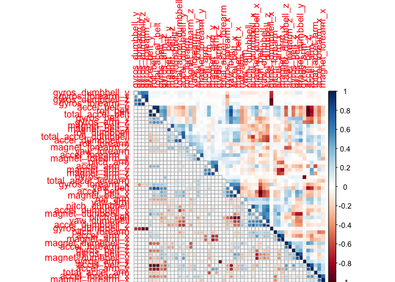
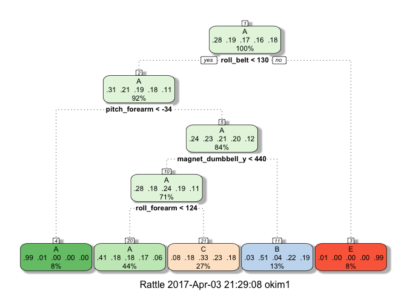
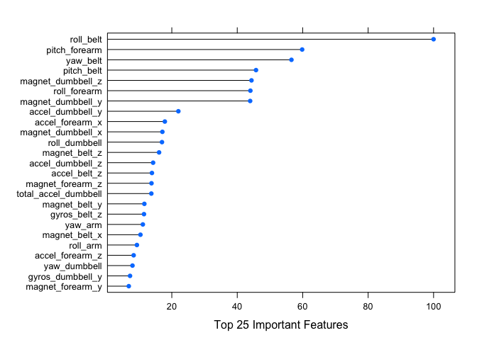
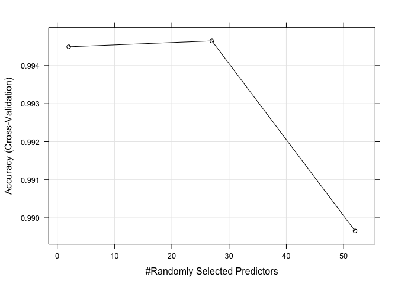

# Prediction Assignment
March 29, 2017  


## Synopsis

One thing that people regularly do is quantify how much of a particular activity they do, but they rarely quantify how well they do it. In this project, the goal will be to use data from accelerometers on the belt, forearm, arm, and dumbell of 6 participants.

The goal of the project is to predict the manner in which they did the exercise. This is the "classe" variable in the training set. We may use any of the other variables to predict with.   

The report describes  

- how we built our model, 
- how we used cross validation, 
- what we think the expected out of sample error is, and 
- why we made the choices we did. 


## Background 
Using devices such as Jawbone Up, Nike FuelBand, and Fitbit it is now possible to collect a large amount of data about personal activity relatively inexpensively. These type of devices are part of the quantified self movement – a group of enthusiasts who take measurements abo  ut themselves regularly to improve their health, to find patterns in their behavior, or because they are tech geeks. One thing that people regularly do is quantify how much of a particular activity they do, but they rarely quantify how well they do it. In this project, your goal will be to use data from accelerometers on the belt, forearm, arm, and dumbell of 6 participants. They were asked to perform barbell lifts correctly and incorrectly in 5 different ways. More information is available from the website here: [The data information][3] (see the section on the Weight Lifting Exercise Dataset).


## Data
The training data for this project are available here:
[The Training Data][1].
  
The test data are available here:
[The Testing Data][2]

The data for this project come from this source [The data information][3]

[1]:https://d396qusza40orc.cloudfront.net/predmachlearn/pml-training.csv   "The training data"
[2]:https://d396qusza40orc.cloudfront.net/predmachlearn/pml-testing.csv  "The test data"  
[3]:http://groupware.les.inf.puc-rio.br/har "The data information"


## Summary of Analysis
1. Data exploration (structure, consistency of the column names in both training and testing data)
2. Remove variables of near zero variability
3. Remove variables with more than 50% missing values
4. Remove variables not suitable for analysis, eg. user_name, timestamps, etc.
5. Examine existence of highly correlated pairs
6. 5-fold cross-validation and PCA using trainControl()
7. Build model with multiple methods
8. Compare model performance and select the best model
9. The expected out of sample error
10. Predict on testing data using the best model  


## Analysis

#### Download and import the data into the workspace

```r
trainURL="https://d396qusza40orc.cloudfront.net/predmachlearn/pml-training.csv"
if(!file.exists("./pml-training.csv")){
  download.file(trainURL, destfile = "./pml-training.csv")}
training<- read.csv("./pml-training.csv",header = TRUE)
testURL="https://d396qusza40orc.cloudfront.net/predmachlearn/pml-testing.csv"
if(!file.exists("./pml-testing.csv")){
  download.file(testURL, destfile = "./pml-testing.csv")}
testing<- read.csv("./pml-testing.csv",header = TRUE)
```


#### Data Exploration 

The data structure of training data and coherence of column names from training and test data

```r
str(training)
```

```
## 'data.frame':	19622 obs. of  160 variables:
##  $ X                       : int  1 2 3 4 5 6 7 8 9 10 ...
##  $ user_name               : Factor w/ 6 levels "adelmo","carlitos",..: 2 2 2 2 2 2 2 2 2 2 ...
##  $ raw_timestamp_part_1    : int  1323084231 1323084231 1323084231 1323084232 1323084232 1323084232 1323084232 1323084232 1323084232 1323084232 ...
##  $ raw_timestamp_part_2    : int  788290 808298 820366 120339 196328 304277 368296 440390 484323 484434 ...
##  $ cvtd_timestamp          : Factor w/ 20 levels "02/12/2011 13:32",..: 9 9 9 9 9 9 9 9 9 9 ...
##  $ new_window              : Factor w/ 2 levels "no","yes": 1 1 1 1 1 1 1 1 1 1 ...
##  $ num_window              : int  11 11 11 12 12 12 12 12 12 12 ...
##  $ roll_belt               : num  1.41 1.41 1.42 1.48 1.48 1.45 1.42 1.42 1.43 1.45 ...
##  $ pitch_belt              : num  8.07 8.07 8.07 8.05 8.07 8.06 8.09 8.13 8.16 8.17 ...
##  $ yaw_belt                : num  -94.4 -94.4 -94.4 -94.4 -94.4 -94.4 -94.4 -94.4 -94.4 -94.4 ...
##  $ total_accel_belt        : int  3 3 3 3 3 3 3 3 3 3 ...
##  $ kurtosis_roll_belt      : Factor w/ 397 levels "","-0.016850",..: 1 1 1 1 1 1 1 1 1 1 ...
##  $ kurtosis_picth_belt     : Factor w/ 317 levels "","-0.021887",..: 1 1 1 1 1 1 1 1 1 1 ...
##  $ kurtosis_yaw_belt       : Factor w/ 2 levels "","#DIV/0!": 1 1 1 1 1 1 1 1 1 1 ...
##  $ skewness_roll_belt      : Factor w/ 395 levels "","-0.003095",..: 1 1 1 1 1 1 1 1 1 1 ...
##  $ skewness_roll_belt.1    : Factor w/ 338 levels "","-0.005928",..: 1 1 1 1 1 1 1 1 1 1 ...
##  $ skewness_yaw_belt       : Factor w/ 2 levels "","#DIV/0!": 1 1 1 1 1 1 1 1 1 1 ...
##  $ max_roll_belt           : num  NA NA NA NA NA NA NA NA NA NA ...
##  $ max_picth_belt          : int  NA NA NA NA NA NA NA NA NA NA ...
##  $ max_yaw_belt            : Factor w/ 68 levels "","-0.1","-0.2",..: 1 1 1 1 1 1 1 1 1 1 ...
##  $ min_roll_belt           : num  NA NA NA NA NA NA NA NA NA NA ...
##  $ min_pitch_belt          : int  NA NA NA NA NA NA NA NA NA NA ...
##  $ min_yaw_belt            : Factor w/ 68 levels "","-0.1","-0.2",..: 1 1 1 1 1 1 1 1 1 1 ...
##  $ amplitude_roll_belt     : num  NA NA NA NA NA NA NA NA NA NA ...
##  $ amplitude_pitch_belt    : int  NA NA NA NA NA NA NA NA NA NA ...
##  $ amplitude_yaw_belt      : Factor w/ 4 levels "","#DIV/0!","0.00",..: 1 1 1 1 1 1 1 1 1 1 ...
##  $ var_total_accel_belt    : num  NA NA NA NA NA NA NA NA NA NA ...
##  $ avg_roll_belt           : num  NA NA NA NA NA NA NA NA NA NA ...
##  $ stddev_roll_belt        : num  NA NA NA NA NA NA NA NA NA NA ...
##  $ var_roll_belt           : num  NA NA NA NA NA NA NA NA NA NA ...
##  $ avg_pitch_belt          : num  NA NA NA NA NA NA NA NA NA NA ...
##  $ stddev_pitch_belt       : num  NA NA NA NA NA NA NA NA NA NA ...
##  $ var_pitch_belt          : num  NA NA NA NA NA NA NA NA NA NA ...
##  $ avg_yaw_belt            : num  NA NA NA NA NA NA NA NA NA NA ...
##  $ stddev_yaw_belt         : num  NA NA NA NA NA NA NA NA NA NA ...
##  $ var_yaw_belt            : num  NA NA NA NA NA NA NA NA NA NA ...
##  $ gyros_belt_x            : num  0 0.02 0 0.02 0.02 0.02 0.02 0.02 0.02 0.03 ...
##  $ gyros_belt_y            : num  0 0 0 0 0.02 0 0 0 0 0 ...
##  $ gyros_belt_z            : num  -0.02 -0.02 -0.02 -0.03 -0.02 -0.02 -0.02 -0.02 -0.02 0 ...
##  $ accel_belt_x            : int  -21 -22 -20 -22 -21 -21 -22 -22 -20 -21 ...
##  $ accel_belt_y            : int  4 4 5 3 2 4 3 4 2 4 ...
##  $ accel_belt_z            : int  22 22 23 21 24 21 21 21 24 22 ...
##  $ magnet_belt_x           : int  -3 -7 -2 -6 -6 0 -4 -2 1 -3 ...
##  $ magnet_belt_y           : int  599 608 600 604 600 603 599 603 602 609 ...
##  $ magnet_belt_z           : int  -313 -311 -305 -310 -302 -312 -311 -313 -312 -308 ...
##  $ roll_arm                : num  -128 -128 -128 -128 -128 -128 -128 -128 -128 -128 ...
##  $ pitch_arm               : num  22.5 22.5 22.5 22.1 22.1 22 21.9 21.8 21.7 21.6 ...
##  $ yaw_arm                 : num  -161 -161 -161 -161 -161 -161 -161 -161 -161 -161 ...
##  $ total_accel_arm         : int  34 34 34 34 34 34 34 34 34 34 ...
##  $ var_accel_arm           : num  NA NA NA NA NA NA NA NA NA NA ...
##  $ avg_roll_arm            : num  NA NA NA NA NA NA NA NA NA NA ...
##  $ stddev_roll_arm         : num  NA NA NA NA NA NA NA NA NA NA ...
##  $ var_roll_arm            : num  NA NA NA NA NA NA NA NA NA NA ...
##  $ avg_pitch_arm           : num  NA NA NA NA NA NA NA NA NA NA ...
##  $ stddev_pitch_arm        : num  NA NA NA NA NA NA NA NA NA NA ...
##  $ var_pitch_arm           : num  NA NA NA NA NA NA NA NA NA NA ...
##  $ avg_yaw_arm             : num  NA NA NA NA NA NA NA NA NA NA ...
##  $ stddev_yaw_arm          : num  NA NA NA NA NA NA NA NA NA NA ...
##  $ var_yaw_arm             : num  NA NA NA NA NA NA NA NA NA NA ...
##  $ gyros_arm_x             : num  0 0.02 0.02 0.02 0 0.02 0 0.02 0.02 0.02 ...
##  $ gyros_arm_y             : num  0 -0.02 -0.02 -0.03 -0.03 -0.03 -0.03 -0.02 -0.03 -0.03 ...
##  $ gyros_arm_z             : num  -0.02 -0.02 -0.02 0.02 0 0 0 0 -0.02 -0.02 ...
##  $ accel_arm_x             : int  -288 -290 -289 -289 -289 -289 -289 -289 -288 -288 ...
##  $ accel_arm_y             : int  109 110 110 111 111 111 111 111 109 110 ...
##  $ accel_arm_z             : int  -123 -125 -126 -123 -123 -122 -125 -124 -122 -124 ...
##  $ magnet_arm_x            : int  -368 -369 -368 -372 -374 -369 -373 -372 -369 -376 ...
##  $ magnet_arm_y            : int  337 337 344 344 337 342 336 338 341 334 ...
##  $ magnet_arm_z            : int  516 513 513 512 506 513 509 510 518 516 ...
##  $ kurtosis_roll_arm       : Factor w/ 330 levels "","-0.02438",..: 1 1 1 1 1 1 1 1 1 1 ...
##  $ kurtosis_picth_arm      : Factor w/ 328 levels "","-0.00484",..: 1 1 1 1 1 1 1 1 1 1 ...
##  $ kurtosis_yaw_arm        : Factor w/ 395 levels "","-0.01548",..: 1 1 1 1 1 1 1 1 1 1 ...
##  $ skewness_roll_arm       : Factor w/ 331 levels "","-0.00051",..: 1 1 1 1 1 1 1 1 1 1 ...
##  $ skewness_pitch_arm      : Factor w/ 328 levels "","-0.00184",..: 1 1 1 1 1 1 1 1 1 1 ...
##  $ skewness_yaw_arm        : Factor w/ 395 levels "","-0.00311",..: 1 1 1 1 1 1 1 1 1 1 ...
##  $ max_roll_arm            : num  NA NA NA NA NA NA NA NA NA NA ...
##  $ max_picth_arm           : num  NA NA NA NA NA NA NA NA NA NA ...
##  $ max_yaw_arm             : int  NA NA NA NA NA NA NA NA NA NA ...
##  $ min_roll_arm            : num  NA NA NA NA NA NA NA NA NA NA ...
##  $ min_pitch_arm           : num  NA NA NA NA NA NA NA NA NA NA ...
##  $ min_yaw_arm             : int  NA NA NA NA NA NA NA NA NA NA ...
##  $ amplitude_roll_arm      : num  NA NA NA NA NA NA NA NA NA NA ...
##  $ amplitude_pitch_arm     : num  NA NA NA NA NA NA NA NA NA NA ...
##  $ amplitude_yaw_arm       : int  NA NA NA NA NA NA NA NA NA NA ...
##  $ roll_dumbbell           : num  13.1 13.1 12.9 13.4 13.4 ...
##  $ pitch_dumbbell          : num  -70.5 -70.6 -70.3 -70.4 -70.4 ...
##  $ yaw_dumbbell            : num  -84.9 -84.7 -85.1 -84.9 -84.9 ...
##  $ kurtosis_roll_dumbbell  : Factor w/ 398 levels "","-0.0035","-0.0073",..: 1 1 1 1 1 1 1 1 1 1 ...
##  $ kurtosis_picth_dumbbell : Factor w/ 401 levels "","-0.0163","-0.0233",..: 1 1 1 1 1 1 1 1 1 1 ...
##  $ kurtosis_yaw_dumbbell   : Factor w/ 2 levels "","#DIV/0!": 1 1 1 1 1 1 1 1 1 1 ...
##  $ skewness_roll_dumbbell  : Factor w/ 401 levels "","-0.0082","-0.0096",..: 1 1 1 1 1 1 1 1 1 1 ...
##  $ skewness_pitch_dumbbell : Factor w/ 402 levels "","-0.0053","-0.0084",..: 1 1 1 1 1 1 1 1 1 1 ...
##  $ skewness_yaw_dumbbell   : Factor w/ 2 levels "","#DIV/0!": 1 1 1 1 1 1 1 1 1 1 ...
##  $ max_roll_dumbbell       : num  NA NA NA NA NA NA NA NA NA NA ...
##  $ max_picth_dumbbell      : num  NA NA NA NA NA NA NA NA NA NA ...
##  $ max_yaw_dumbbell        : Factor w/ 73 levels "","-0.1","-0.2",..: 1 1 1 1 1 1 1 1 1 1 ...
##  $ min_roll_dumbbell       : num  NA NA NA NA NA NA NA NA NA NA ...
##  $ min_pitch_dumbbell      : num  NA NA NA NA NA NA NA NA NA NA ...
##  $ min_yaw_dumbbell        : Factor w/ 73 levels "","-0.1","-0.2",..: 1 1 1 1 1 1 1 1 1 1 ...
##  $ amplitude_roll_dumbbell : num  NA NA NA NA NA NA NA NA NA NA ...
##   [list output truncated]
```

```r
#str(testing)
# Are the column names(except classe) consistent between training and testing data
all.equal(colnames(training)[1:length(colnames(training))-1],colnames(testing)[1:length(colnames(testing))-1])
```

```
## [1] TRUE
```


#### Feature Extraction
Loading the required libraries,

```
## R session is headless; GTK+ not initialized.
```

```
## Rattle: A free graphical interface for data mining with R.
## Version 4.1.0 Copyright (c) 2006-2015 Togaware Pty Ltd.
## Type 'rattle()' to shake, rattle, and roll your data.
```

```
## 
## Attaching package: 'dplyr'
```

```
## The following objects are masked from 'package:stats':
## 
##     filter, lag
```

```
## The following objects are masked from 'package:base':
## 
##     intersect, setdiff, setequal, union
```

Keeping just the fields with some variability in the analysis,

```r
nearzero<-nearZeroVar(training, saveMetrics = TRUE)
# column names with near zero variability
colnames(training[which(nearzero$nzv)])
```

```
##  [1] "new_window"              "kurtosis_roll_belt"     
##  [3] "kurtosis_picth_belt"     "kurtosis_yaw_belt"      
##  [5] "skewness_roll_belt"      "skewness_roll_belt.1"   
##  [7] "skewness_yaw_belt"       "max_yaw_belt"           
##  [9] "min_yaw_belt"            "amplitude_yaw_belt"     
## [11] "avg_roll_arm"            "stddev_roll_arm"        
## [13] "var_roll_arm"            "avg_pitch_arm"          
## [15] "stddev_pitch_arm"        "var_pitch_arm"          
## [17] "avg_yaw_arm"             "stddev_yaw_arm"         
## [19] "var_yaw_arm"             "kurtosis_roll_arm"      
## [21] "kurtosis_picth_arm"      "kurtosis_yaw_arm"       
## [23] "skewness_roll_arm"       "skewness_pitch_arm"     
## [25] "skewness_yaw_arm"        "max_roll_arm"           
## [27] "min_roll_arm"            "min_pitch_arm"          
## [29] "amplitude_roll_arm"      "amplitude_pitch_arm"    
## [31] "kurtosis_roll_dumbbell"  "kurtosis_picth_dumbbell"
## [33] "kurtosis_yaw_dumbbell"   "skewness_roll_dumbbell" 
## [35] "skewness_pitch_dumbbell" "skewness_yaw_dumbbell"  
## [37] "max_yaw_dumbbell"        "min_yaw_dumbbell"       
## [39] "amplitude_yaw_dumbbell"  "kurtosis_roll_forearm"  
## [41] "kurtosis_picth_forearm"  "kurtosis_yaw_forearm"   
## [43] "skewness_roll_forearm"   "skewness_pitch_forearm" 
## [45] "skewness_yaw_forearm"    "max_roll_forearm"       
## [47] "max_yaw_forearm"         "min_roll_forearm"       
## [49] "min_yaw_forearm"         "amplitude_roll_forearm" 
## [51] "amplitude_yaw_forearm"   "avg_roll_forearm"       
## [53] "stddev_roll_forearm"     "var_roll_forearm"       
## [55] "avg_pitch_forearm"       "stddev_pitch_forearm"   
## [57] "var_pitch_forearm"       "avg_yaw_forearm"        
## [59] "stddev_yaw_forearm"      "var_yaw_forearm"
```

```r
# remove columns with near zero variability
train<-training[,!nearzero$nzv]

# column with more than 50% missing values removed
to_remove<-sapply(colnames(train), function(x) if(sum(is.na(train[,x]))>.5*nrow(train)) {return(TRUE)}else{return(FALSE)})
train<-train[,!to_remove]
```
  
Now, remove variables not suitable for analysis: X, user_name,raw_timestamp_part_1, raw_timestamp_part_2, cvtd_timestamp, num_window 

```r
train<-train[,-(1:6)]
```
  
The variables to be used for analysis and the summary of the variables

```r
names(train)
```

```
##  [1] "roll_belt"            "pitch_belt"           "yaw_belt"            
##  [4] "total_accel_belt"     "gyros_belt_x"         "gyros_belt_y"        
##  [7] "gyros_belt_z"         "accel_belt_x"         "accel_belt_y"        
## [10] "accel_belt_z"         "magnet_belt_x"        "magnet_belt_y"       
## [13] "magnet_belt_z"        "roll_arm"             "pitch_arm"           
## [16] "yaw_arm"              "total_accel_arm"      "gyros_arm_x"         
## [19] "gyros_arm_y"          "gyros_arm_z"          "accel_arm_x"         
## [22] "accel_arm_y"          "accel_arm_z"          "magnet_arm_x"        
## [25] "magnet_arm_y"         "magnet_arm_z"         "roll_dumbbell"       
## [28] "pitch_dumbbell"       "yaw_dumbbell"         "total_accel_dumbbell"
## [31] "gyros_dumbbell_x"     "gyros_dumbbell_y"     "gyros_dumbbell_z"    
## [34] "accel_dumbbell_x"     "accel_dumbbell_y"     "accel_dumbbell_z"    
## [37] "magnet_dumbbell_x"    "magnet_dumbbell_y"    "magnet_dumbbell_z"   
## [40] "roll_forearm"         "pitch_forearm"        "yaw_forearm"         
## [43] "total_accel_forearm"  "gyros_forearm_x"      "gyros_forearm_y"     
## [46] "gyros_forearm_z"      "accel_forearm_x"      "accel_forearm_y"     
## [49] "accel_forearm_z"      "magnet_forearm_x"     "magnet_forearm_y"    
## [52] "magnet_forearm_z"     "classe"
```

```r
# summary of each variables
summary(train)
```

```
##    roll_belt        pitch_belt          yaw_belt       total_accel_belt
##  Min.   :-28.90   Min.   :-55.8000   Min.   :-180.00   Min.   : 0.00   
##  1st Qu.:  1.10   1st Qu.:  1.7600   1st Qu.: -88.30   1st Qu.: 3.00   
##  Median :113.00   Median :  5.2800   Median : -13.00   Median :17.00   
##  Mean   : 64.41   Mean   :  0.3053   Mean   : -11.21   Mean   :11.31   
##  3rd Qu.:123.00   3rd Qu.: 14.9000   3rd Qu.:  12.90   3rd Qu.:18.00   
##  Max.   :162.00   Max.   : 60.3000   Max.   : 179.00   Max.   :29.00   
##   gyros_belt_x        gyros_belt_y       gyros_belt_z    
##  Min.   :-1.040000   Min.   :-0.64000   Min.   :-1.4600  
##  1st Qu.:-0.030000   1st Qu.: 0.00000   1st Qu.:-0.2000  
##  Median : 0.030000   Median : 0.02000   Median :-0.1000  
##  Mean   :-0.005592   Mean   : 0.03959   Mean   :-0.1305  
##  3rd Qu.: 0.110000   3rd Qu.: 0.11000   3rd Qu.:-0.0200  
##  Max.   : 2.220000   Max.   : 0.64000   Max.   : 1.6200  
##   accel_belt_x       accel_belt_y     accel_belt_z     magnet_belt_x  
##  Min.   :-120.000   Min.   :-69.00   Min.   :-275.00   Min.   :-52.0  
##  1st Qu.: -21.000   1st Qu.:  3.00   1st Qu.:-162.00   1st Qu.:  9.0  
##  Median : -15.000   Median : 35.00   Median :-152.00   Median : 35.0  
##  Mean   :  -5.595   Mean   : 30.15   Mean   : -72.59   Mean   : 55.6  
##  3rd Qu.:  -5.000   3rd Qu.: 61.00   3rd Qu.:  27.00   3rd Qu.: 59.0  
##  Max.   :  85.000   Max.   :164.00   Max.   : 105.00   Max.   :485.0  
##  magnet_belt_y   magnet_belt_z       roll_arm         pitch_arm      
##  Min.   :354.0   Min.   :-623.0   Min.   :-180.00   Min.   :-88.800  
##  1st Qu.:581.0   1st Qu.:-375.0   1st Qu.: -31.77   1st Qu.:-25.900  
##  Median :601.0   Median :-320.0   Median :   0.00   Median :  0.000  
##  Mean   :593.7   Mean   :-345.5   Mean   :  17.83   Mean   : -4.612  
##  3rd Qu.:610.0   3rd Qu.:-306.0   3rd Qu.:  77.30   3rd Qu.: 11.200  
##  Max.   :673.0   Max.   : 293.0   Max.   : 180.00   Max.   : 88.500  
##     yaw_arm          total_accel_arm  gyros_arm_x        gyros_arm_y     
##  Min.   :-180.0000   Min.   : 1.00   Min.   :-6.37000   Min.   :-3.4400  
##  1st Qu.: -43.1000   1st Qu.:17.00   1st Qu.:-1.33000   1st Qu.:-0.8000  
##  Median :   0.0000   Median :27.00   Median : 0.08000   Median :-0.2400  
##  Mean   :  -0.6188   Mean   :25.51   Mean   : 0.04277   Mean   :-0.2571  
##  3rd Qu.:  45.8750   3rd Qu.:33.00   3rd Qu.: 1.57000   3rd Qu.: 0.1400  
##  Max.   : 180.0000   Max.   :66.00   Max.   : 4.87000   Max.   : 2.8400  
##   gyros_arm_z       accel_arm_x       accel_arm_y      accel_arm_z     
##  Min.   :-2.3300   Min.   :-404.00   Min.   :-318.0   Min.   :-636.00  
##  1st Qu.:-0.0700   1st Qu.:-242.00   1st Qu.: -54.0   1st Qu.:-143.00  
##  Median : 0.2300   Median : -44.00   Median :  14.0   Median : -47.00  
##  Mean   : 0.2695   Mean   : -60.24   Mean   :  32.6   Mean   : -71.25  
##  3rd Qu.: 0.7200   3rd Qu.:  84.00   3rd Qu.: 139.0   3rd Qu.:  23.00  
##  Max.   : 3.0200   Max.   : 437.00   Max.   : 308.0   Max.   : 292.00  
##   magnet_arm_x     magnet_arm_y     magnet_arm_z    roll_dumbbell    
##  Min.   :-584.0   Min.   :-392.0   Min.   :-597.0   Min.   :-153.71  
##  1st Qu.:-300.0   1st Qu.:  -9.0   1st Qu.: 131.2   1st Qu.: -18.49  
##  Median : 289.0   Median : 202.0   Median : 444.0   Median :  48.17  
##  Mean   : 191.7   Mean   : 156.6   Mean   : 306.5   Mean   :  23.84  
##  3rd Qu.: 637.0   3rd Qu.: 323.0   3rd Qu.: 545.0   3rd Qu.:  67.61  
##  Max.   : 782.0   Max.   : 583.0   Max.   : 694.0   Max.   : 153.55  
##  pitch_dumbbell     yaw_dumbbell      total_accel_dumbbell
##  Min.   :-149.59   Min.   :-150.871   Min.   : 0.00       
##  1st Qu.: -40.89   1st Qu.: -77.644   1st Qu.: 4.00       
##  Median : -20.96   Median :  -3.324   Median :10.00       
##  Mean   : -10.78   Mean   :   1.674   Mean   :13.72       
##  3rd Qu.:  17.50   3rd Qu.:  79.643   3rd Qu.:19.00       
##  Max.   : 149.40   Max.   : 154.952   Max.   :58.00       
##  gyros_dumbbell_x    gyros_dumbbell_y   gyros_dumbbell_z 
##  Min.   :-204.0000   Min.   :-2.10000   Min.   : -2.380  
##  1st Qu.:  -0.0300   1st Qu.:-0.14000   1st Qu.: -0.310  
##  Median :   0.1300   Median : 0.03000   Median : -0.130  
##  Mean   :   0.1611   Mean   : 0.04606   Mean   : -0.129  
##  3rd Qu.:   0.3500   3rd Qu.: 0.21000   3rd Qu.:  0.030  
##  Max.   :   2.2200   Max.   :52.00000   Max.   :317.000  
##  accel_dumbbell_x  accel_dumbbell_y  accel_dumbbell_z  magnet_dumbbell_x
##  Min.   :-419.00   Min.   :-189.00   Min.   :-334.00   Min.   :-643.0   
##  1st Qu.: -50.00   1st Qu.:  -8.00   1st Qu.:-142.00   1st Qu.:-535.0   
##  Median :  -8.00   Median :  41.50   Median :  -1.00   Median :-479.0   
##  Mean   : -28.62   Mean   :  52.63   Mean   : -38.32   Mean   :-328.5   
##  3rd Qu.:  11.00   3rd Qu.: 111.00   3rd Qu.:  38.00   3rd Qu.:-304.0   
##  Max.   : 235.00   Max.   : 315.00   Max.   : 318.00   Max.   : 592.0   
##  magnet_dumbbell_y magnet_dumbbell_z  roll_forearm       pitch_forearm   
##  Min.   :-3600     Min.   :-262.00   Min.   :-180.0000   Min.   :-72.50  
##  1st Qu.:  231     1st Qu.: -45.00   1st Qu.:  -0.7375   1st Qu.:  0.00  
##  Median :  311     Median :  13.00   Median :  21.7000   Median :  9.24  
##  Mean   :  221     Mean   :  46.05   Mean   :  33.8265   Mean   : 10.71  
##  3rd Qu.:  390     3rd Qu.:  95.00   3rd Qu.: 140.0000   3rd Qu.: 28.40  
##  Max.   :  633     Max.   : 452.00   Max.   : 180.0000   Max.   : 89.80  
##   yaw_forearm      total_accel_forearm gyros_forearm_x  
##  Min.   :-180.00   Min.   :  0.00      Min.   :-22.000  
##  1st Qu.: -68.60   1st Qu.: 29.00      1st Qu.: -0.220  
##  Median :   0.00   Median : 36.00      Median :  0.050  
##  Mean   :  19.21   Mean   : 34.72      Mean   :  0.158  
##  3rd Qu.: 110.00   3rd Qu.: 41.00      3rd Qu.:  0.560  
##  Max.   : 180.00   Max.   :108.00      Max.   :  3.970  
##  gyros_forearm_y     gyros_forearm_z    accel_forearm_x   accel_forearm_y 
##  Min.   : -7.02000   Min.   : -8.0900   Min.   :-498.00   Min.   :-632.0  
##  1st Qu.: -1.46000   1st Qu.: -0.1800   1st Qu.:-178.00   1st Qu.:  57.0  
##  Median :  0.03000   Median :  0.0800   Median : -57.00   Median : 201.0  
##  Mean   :  0.07517   Mean   :  0.1512   Mean   : -61.65   Mean   : 163.7  
##  3rd Qu.:  1.62000   3rd Qu.:  0.4900   3rd Qu.:  76.00   3rd Qu.: 312.0  
##  Max.   :311.00000   Max.   :231.0000   Max.   : 477.00   Max.   : 923.0  
##  accel_forearm_z   magnet_forearm_x  magnet_forearm_y magnet_forearm_z
##  Min.   :-446.00   Min.   :-1280.0   Min.   :-896.0   Min.   :-973.0  
##  1st Qu.:-182.00   1st Qu.: -616.0   1st Qu.:   2.0   1st Qu.: 191.0  
##  Median : -39.00   Median : -378.0   Median : 591.0   Median : 511.0  
##  Mean   : -55.29   Mean   : -312.6   Mean   : 380.1   Mean   : 393.6  
##  3rd Qu.:  26.00   3rd Qu.:  -73.0   3rd Qu.: 737.0   3rd Qu.: 653.0  
##  Max.   : 291.00   Max.   :  672.0   Max.   :1480.0   Max.   :1090.0  
##  classe  
##  A:5580  
##  B:3797  
##  C:3422  
##  D:3216  
##  E:3607  
## 
```

```r
# columns with high in pair-wise correlation
hi_corr_columns<-findCorrelation(cor(train[,-53]))
length(hi_corr_columns)
```

```
## [1] 7
```

```r
corrplot.mixed(cor(train[,-53]),lower="circle", upper="color", 
               tl.pos="lt", diag="n", order="hclust", hclust.method="complete")
```

<!-- -->

#### Cross-validation and PCA

```r
# 5-fold cross validation with trainControl()
trainCtl<-trainControl(method="cv",number=5, preProcOptions="pca",allowParallel=TRUE)
```

#### Models 
Support Vector Machine Radial

```r
model_svmR<-train(classe~.,method="svmRadial",data=train, trControl=trainCtl)
```

```
## Loading required package: kernlab
```

```
## 
## Attaching package: 'kernlab'
```

```
## The following object is masked from 'package:ggplot2':
## 
##     alpha
```

```r
model_svmR
```

```
## Support Vector Machines with Radial Basis Function Kernel 
## 
## 19622 samples
##    52 predictor
##     5 classes: 'A', 'B', 'C', 'D', 'E' 
## 
## No pre-processing
## Resampling: Cross-Validated (5 fold) 
## Summary of sample sizes: 15698, 15698, 15697, 15698, 15697 
## Resampling results across tuning parameters:
## 
##   C     Accuracy   Kappa    
##   0.25  0.8769236  0.8439584
##   0.50  0.9060746  0.8809274
##   1.00  0.9336459  0.9159086
## 
## Tuning parameter 'sigma' was held constant at a value of 0.01386393
## Accuracy was used to select the optimal model using  the largest value.
## The final values used for the model were sigma = 0.01386393 and C = 1.
```
Random Forest

```r
model_rf<-train(classe~.,method="rf",data=train, trControl=trainCtl)
```

```
## Loading required package: randomForest
```

```
## randomForest 4.6-12
```

```
## Type rfNews() to see new features/changes/bug fixes.
```

```
## 
## Attaching package: 'randomForest'
```

```
## The following object is masked from 'package:dplyr':
## 
##     combine
```

```
## The following object is masked from 'package:ggplot2':
## 
##     margin
```

```r
model_rf
```

```
## Random Forest 
## 
## 19622 samples
##    52 predictor
##     5 classes: 'A', 'B', 'C', 'D', 'E' 
## 
## No pre-processing
## Resampling: Cross-Validated (5 fold) 
## Summary of sample sizes: 15697, 15697, 15697, 15699, 15698 
## Resampling results across tuning parameters:
## 
##   mtry  Accuracy   Kappa    
##    2    0.9944960  0.9930376
##   27    0.9946489  0.9932309
##   52    0.9896544  0.9869119
## 
## Accuracy was used to select the optimal model using  the largest value.
## The final value used for the model was mtry = 27.
```
RPart

```r
model_rpart<-train(classe~.,method="rpart",data=train, trControl=trainCtl)
fancyRpartPlot(model_rpart$finalModel)
```

<!-- -->

```r
model_rpart
```

```
## CART 
## 
## 19622 samples
##    52 predictor
##     5 classes: 'A', 'B', 'C', 'D', 'E' 
## 
## No pre-processing
## Resampling: Cross-Validated (5 fold) 
## Summary of sample sizes: 15697, 15698, 15698, 15698, 15697 
## Resampling results across tuning parameters:
## 
##   cp          Accuracy   Kappa     
##   0.03567868  0.5086643  0.35840845
##   0.05998671  0.4154510  0.20768110
##   0.11515454  0.3165276  0.04894028
## 
## Accuracy was used to select the optimal model using  the largest value.
## The final value used for the model was cp = 0.03567868.
```
  
  
#### Model comparison

```r
model=c("rpart","randomForest","svmRadical")
accuracy<-c(max(model_rpart$results$Accuracy),
            max(model_rf$results$Accuracy),
            max(model_svmR$results$Accuracy))
kappa<-c(max(model_rpart$results$Kappa),
         max(model_rf$results$Kappa),
         max(model_svmR$results$Kappa))
modelComparison<-cbind(model,accuracy,kappa)
modelComparison
```

```
##      model          accuracy            kappa              
## [1,] "rpart"        "0.508664264334457" "0.358408445486623"
## [2,] "randomForest" "0.994648889256047" "0.993230946766311"
## [3,] "svmRadical"   "0.933645857275496" "0.915908587291052"
```

```r
#knitr::kable(modelComparison)
```
  

#### Model selection
According to the result of each models, the random forest model has the highest accuracy. Now we predict with the random forest model on the testing data.
The top 25 important predictors of the this model is;

```r
plot(varImp(model_rf),xlab="Top 25 Important Features",top=25)
```

<!-- -->

```r
trellis.par.set(caretTheme())
plot(model_rf)
```

<!-- -->
  
##### The expected out of sample error
In random forests, there is no need for cross-validation or a separate test set to get an unbiased estimate of the test set error. It is estimated internally, during the run, as follows:

Each tree is constructed using a different bootstrap sample from the original data. About one-third of the cases are left out of the bootstrap sample and not used in the construction of the kth tree.

Put each case left out in the construction of the kth tree down the kth tree to get a classification. In this way, a test set classification is obtained for each case in about one-third of the trees. At the end of the run, take j to be the class that got most of the votes every time case n was oob. The proportion of times that j is not equal to the true class of n averaged over all cases is the oob error estimate. This has proven to be unbiased in many tests.[Reference][4]  

## Prediction

```r
pred<-predict(model_rf,testing)
pred
```

```
##  [1] B A B A A E D B A A B C B A E E A B B B
## Levels: A B C D E
```


[4]:https://www.stat.berkeley.edu/~breiman/RandomForests/cc_home.htm "Reference"
